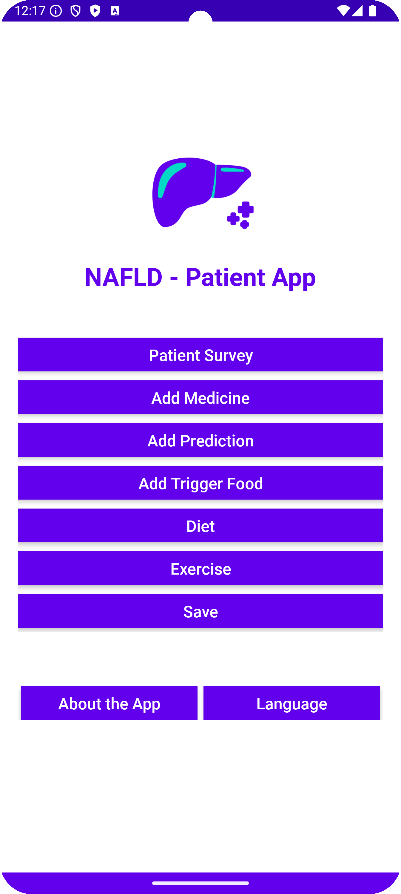

# **NAFLD Patient App**

The **NAFLD Patient App** is an Android application designed to help users monitor and assess their risk of **Non-Alcoholic Fatty Liver Disease (NAFLD)**. It provides a user-friendly interface for inputting health data and receiving predictive insights using machine learning.

---

##**Features**

-  **Health Input Form** – Enter values like ALT, AST, BMI, insulin, etc.
- **NAFLD Prediction** – Calculates risk based on a trained machine learning model.
- **Visual Feedback** – Highlights abnormal values and shows healthy ranges.
- **Localized UI** – Supports English and Russian (extendable).
---

## **Preview**

<p align="center">
  
</p>
---

## **Installation**

### **Clone the Repository**
```bash
git clone https://github.com/Pineappledeydre/NAFLD_patient_app.git
cd NAFLD_patient_app
```

### **Open in Android Studio**
1. Open **Android Studio**
2. Select **"Open an existing project"**
3. Navigate to the cloned folder and open it

---

## **Tech Stack**

- **Language:** Kotlin
- **Framework:** Android SDK
- **Build System:** Gradle (Kotlin DSL)
- **ML Model:** Trained externally (EBM via Python)
- **Minimum SDK:** (Specify if known, e.g., 21)
- **Target SDK:** (e.g., 33)

---

## 🔗 **Related Projects**
- [Streamlit NAFLD Prediction App](https://nafld-prediction.streamlit.app/) – Web version of the predictive model

---

## **Project Structure**
```
NAFLD_patient_app/
├── app/                     # Android app source code
├── gradle/                  # Gradle wrapper config
├── .idea/                   # Android Studio config files
├── .gitignore               # Git ignore rules
├── build.gradle.kts         # Project-level Gradle config (Kotlin DSL)
├── settings.gradle.kts      # Module linking
├── gradlew, gradlew.bat     # Gradle wrapper scripts
└── README.md                # This file
```

---

## **Known Issues / TODOs**
- [ ] Integrate real-time API or offline model inference
- [ ] Improve UI for small screen sizes
- [ ] Update EMB - 2.0 version of the model is available

---

## **License**
This project is open-source and available under the [MIT License](LICENSE)

---

## **Credits**
Developed by [@Pineappledeydre](https://github.com/Pineappledeydre)  
NAFLD health research and AI integration by the developer.
